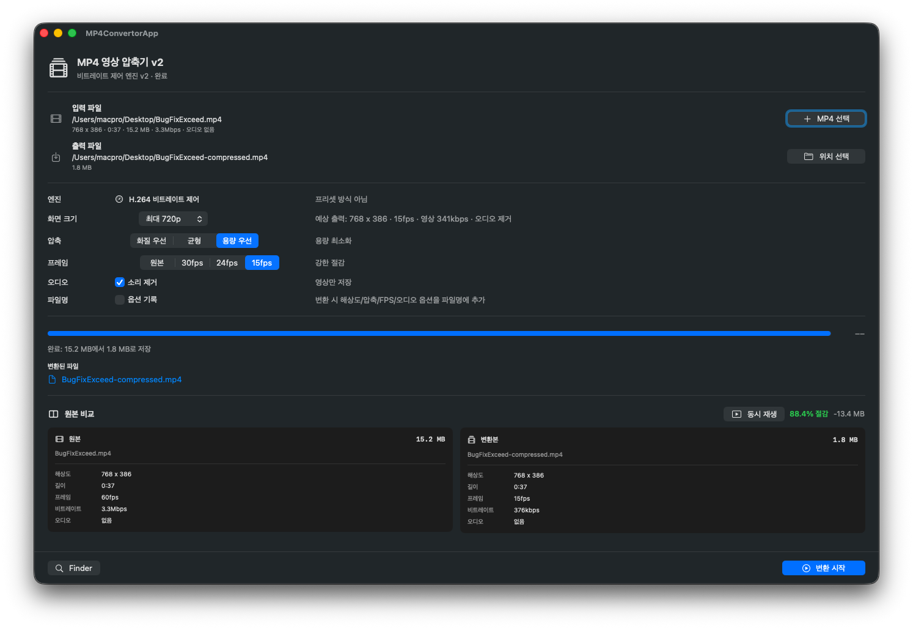
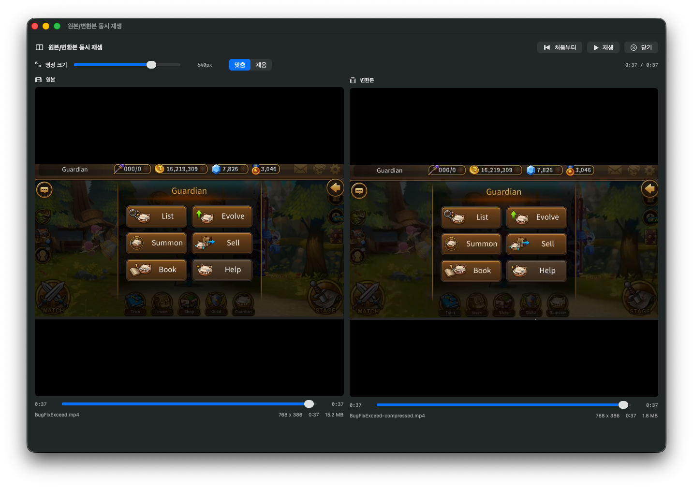

# MP4 영상 압축기

macOS에서 실행되는 SwiftUI 기반 MP4 압축 유틸리티입니다. 외부 `ffmpeg` 없이 macOS 기본 `AVFoundation`으로 MP4를 다시 내보냅니다.

## 스크린샷

### 메인 UI


### 원본/변환본 동시 재생


## 기능

- MP4 입력 파일 선택
- 출력 MP4 저장 위치 선택
- 소리 제거 또는 원본 오디오 유지
- 원본 유지, 최대 1080p, 최대 720p, 최대 480p, 사용자 지정 화면 크기
- 화질 우선, 균형, 용량 우선 비트레이트 기반 압축
- 원본, 30fps, 24fps, 15fps 출력 프레임 제한
- 변환 진행률 표시와 Finder에서 결과 확인
- 변환 후 원본/변환본 비교와 별도 최대화 창에서 동시 동영상 재생
- 동시 재생 위치 슬라이더 동기화, 영상 표시 크기 조절, 맞춤/채움 표시 방식

## 실행

```bash
./run.sh
```

루트의 `run.sh`, `run_bot.sh`, `build.sh`, `build_app.sh`는 편의를 위한 바로가기 스크립트입니다. 실제 명령은 `Scripts/` 폴더 안의 같은 이름 스크립트에 들어 있습니다.

## Mattermost 자동 압축 봇 실행

Mattermost 채널에 업로드된 MP4를 감시하고 자동으로 압축 파일을 스레드 답글로 올리려면 아래 환경 변수를 설정한 뒤 실행합니다.

```bash
export MATTERMOST_BASE_URL="https://chat.example.com"
export MATTERMOST_TOKEN="YOUR_BOT_TOKEN"
export MATTERMOST_CHANNEL_URL="https://chat.example.com/example-team/channels/mp4-compress"
# 또는 export MATTERMOST_CHANNEL_ID="CHANNEL_ID"
export MATTERMOST_BOT_USER_ID="BOT_USER_ID"   # 선택 사항, 자기 자신 메시지 무시용
export MATTERMOST_POLL_INTERVAL="5"           # 선택 사항, 기본 5초

./run_bot.sh
```

봇은 게시물 메시지에서 화질/최대 용량 지시를 읽습니다.

### 마이크 권한 안내 (최초 1회)

봇은 오디오를 AAC로 다시 인코딩하므로 macOS가 "마이크에 접근하려고 합니다" 권한을 요구합니다. 매번 묻지 않도록 봇 바이너리에 마이크 사용 설명을 넣고 **고정 코드사인**으로 서명하기 때문에, 한 번만 허용하면 재실행·재빌드해도 다시 묻지 않습니다.

- `./run_bot.sh` 실행 시 키체인 접근 허용 창이 뜨면 **항상 허용**을 누르세요. (코드사인용, 최초 1회)
- 봇 시작 직후 또는 첫 압축 시 마이크 권한 창이 뜨면 **허용**을 누르세요. (TCC, 최초 1회)
- 이후에는 두 창 모두 다시 나타나지 않습니다.
- 특정 코드사인 식별자를 강제하려면 `export MP4BOT_SIGN_IDENTITY="Developer ID Application: ..."`를 설정합니다. 식별자가 하나도 없으면 로컬 전용 자체 서명 인증서를 자동 생성합니다.
- 권한이 거부 상태로 잠겼다면 시스템 설정 > 개인정보 보호 및 보안 > 마이크에서 다시 허용할 수 있습니다.


- 화질: `high`, `balanced`, `small` 또는 `화질 우선`, `균형`, `용량 우선`
- 최대 용량: `최대 용량 20MB`, `max size: 25mb` 같은 형식
- 응답 테스트: 영상 없이 `응답테스트` 또는 `ping` 입력 시 봇이 정상 동작 메시지로 답글

최대 용량이 지정되면 해상도/FPS/오디오 포함 여부를 단계적으로 조정해 목표 용량 이하를 시도합니다.

### 사용법 확인

채널에서 `help`, `사용법`, `도움말` 중 하나를 입력하면 봇이 사용법 안내를 스레드 답글로 보내줍니다. (봇 멘션 불필요)

- 봇을 태그(@멘션)할 필요 없이 채널에 MP4 파일만 올리면 자동으로 압축합니다.
- 메시지에 옵션을 생략하면 기본값(균형 모드)으로 압축합니다.
- 예: (메시지 없이 파일만 첨부) → 기본 압축, `화질우선` + 파일 → 고화질, `용량우선 20MB` + 파일 → 20MB 이하 목표 압축

## 릴리스용 앱 번들 생성

```bash
./build_app.sh
```

생성 결과는 `dist/MP4Convertor.app`에 저장됩니다.

## 빌드만 확인

```bash
./build.sh
```

`build.sh`는 Swift 실행 파일만 컴파일해서 `.build/release/MP4Convertor`를 만드는 확인용 빌드입니다. `build_app.sh`는 같은 릴리스 빌드를 먼저 수행한 뒤, 실행 파일과 `Support/Info.plist`를 묶어 Finder에서 실행할 수 있는 `dist/MP4Convertor.app` 앱 번들을 만듭니다.

## 요구 사항

- macOS 14 이상
- Swift 6 또는 Xcode Command Line Tools

## 동작 방식

앱은 입력 MP4의 영상 트랙을 읽고 선택한 화면 크기에 맞춰 비율을 유지한 상태로 축소합니다. `소리 제거`가 켜져 있으면 오디오 트랙을 출력하지 않습니다. 영상은 `AVAssetReader`와 `AVAssetWriter`로 H.264 재인코딩하며, 선택한 화질 옵션과 출력 해상도/FPS/원본 추정 비트레이트를 기준으로 목표 비트레이트를 계산합니다. 오디오를 유지하는 경우 AAC로 다시 인코딩해 불필요한 용량 증가를 줄입니다. v2 UI에서는 입력 파일을 고르면 예상 출력 해상도, 출력 FPS, 목표 영상 비트레이트가 화면에 표시됩니다.

프레임 제한 옵션은 출력 FPS를 낮춰 중간 프레임을 재샘플링하는 방식입니다. 움직임이 적거나 공유용으로 쓰는 영상은 24fps 또는 15fps를 선택하면 같은 해상도에서도 파일 크기를 더 줄일 수 있습니다.
